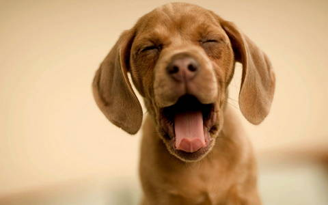

# wow.js-and-animate.css
<!--
                          Как скачать и подключить.
1 шаг. Скачать скрипты wow.js и animate.css с официальных сайтов и разместить их в папке своего проекта.
2 шаг. Подключаем скрипты простым HTML кодом на странице в теге <head> :
    <link rel="stylesheet" href="animate.min.css">
    
3 шаг. Необходимо инициализировать скрипт добавив вот такой код, сразу после его подключения:
    
                              Использование WOW.js
Шаг 1. Выбираем элемент, который хотим анимировать и добавляем ему класс class="wow".
    
Шаг 2. Выбираем анимацию, и добавляем её дополнительным классом к нашей собачке:
    
Шаг 3. Добавляем настройки для анимации если надо, при помощи специальных data-атрибутов :
    
В коде выше я указал, что анимация должна срабатывать, когда картинка пройдет 200 пикселей от низа экрана.
Но при этом у нее будет задержка в пол секунды, а сама анимация будет занимать по времени ровно 2 секунды.
                        Настройки WOW.js анимации через атрибуты
    data-wow-duration – указываем время проигрывания анимации
    data-wow-delay – ставим задержку перед проигрыванием анимации
    data-wow-offset – включение анимации, когда элемент проходит определнное количество пикселей от низа экрана
    data-wow-iteration – количество повторов анимации
Обращаю ваше внимание на то, что эти атрибуты не обязательные. Если вы их не укажете, анимация будет просто
проигрываться по умолчанию, как только элемент появится на экране при прокрутке окна браузера.
-->
